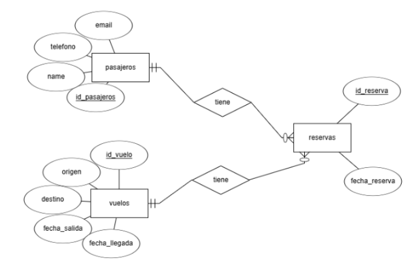

# Proyecto de Gestión de Reservas de Vuelos

 

Este proyecto es una aplicación de gestión de reservas de vuelos utilizando Java y una base de datos MySQL. La base de datos está estructurada en tres tablas: **Vuelos**, **Pasajeros** y **Reservas**. El sistema permite realizar diversas operaciones como crear, actualizar, eliminar, y visualizar registros de vuelos, pasajeros y reservas.

## Requisitos Previos

Para poder ejecutar este proyecto, necesitas tener los siguientes requisitos instalados en tu máquina:

- **XAMPP**: Para ejecutar el servidor de base de datos MySQL.
- **JDK (Java Development Kit)**: Para compilar y ejecutar el código Java.
- **(Opcional) Visual Studio Code**: Como editor de código (aunque puedes usar cualquier editor de tu preferencia).

## Instalación

Sigue estos pasos para instalar y ejecutar el proyecto en tu máquina local:

### 1. Clonar el Repositorio

Abre tu terminal o línea de comandos y ejecuta el siguiente comando para clonar el repositorio:

```bash
git clone https://github.com/Sergiibut05/Trabajo-BBDD-JAVA-Sergii-Butrii.git
```

### 2. Configurar XAMPP
- Abre XAMPP y en la interfaz de usuario, haz clic en Start para iniciar los servicios de Apache y MySQL.
- En el apartado de MySQL, haz clic en Admin. Esto te redirigirá a tu navegador.

### 3. Configurar la Base de Datos
- En el navegador, se abrirá la interfaz de phpMyAdmin. En la barra superior de opciones, haz clic en Importar.
- Selecciona el archivo aerolineasBBDD.sql (que se encuentra en el repositorio) y, al final de la página, haz clic en Importar para cargar la estructura de la base de datos.

### 4.Abrir el Proyecto en tu Editor de Código
- Abre tu editor de código favorito (se recomienda Visual Studio Code para facilitar la experiencia).
- Navega hasta el archivo App.java que se encuentra dentro del directorio del proyecto.
- Y lo ejecutamos

## 2. Diagrama Entidad-Relación de la BBDD
 

- La DataBase es responsable de administrar las reservas de pasajeros durante los vuelos. Cabe señalar que la tabla de reservas contiene dos Foreign Key, una para la id de vuelo y otra para la id de pasajeros. El sistema necesita que las reservas estén vinculadas tanto al vuelo como al pasajero que figura en las otras tablas. Al hacer una nueva reserva, es necesario asegurarse de que el vuelo y el pasajero estén registrados en la base de datos. La ausencia de cualquiera de estos lleva a un error y a la incapacidad de crear una reserva.

## 3. Medidas tomadas
El programa de  Java habilita la ejecución de múltiples operaciones en tablas de bases de datos.

- **Crear**: permite insertar nuevos registros en cualquiera de las tres tablas que se ocupan de vuelos, pasajeros y reservas

- **Modificar**: permite la modificación de los datos existentes en cualquier fila dentro de las tablas

- **Eliminar**: autoriza la eliminación de registros particulares de las tablas según sea necesario.

- **Ver todo**: Ver todas las filas en las tablas

- **Buscar por ID**: Esta función permite buscar entradas particulares por su ID de identificador única dentro de cada tabla

## 4. Conclusión
- El Programa permite la gestión eficiente de reservas de vuelo mientras se mantiene íntegra a través de relaciones entre tablas.


